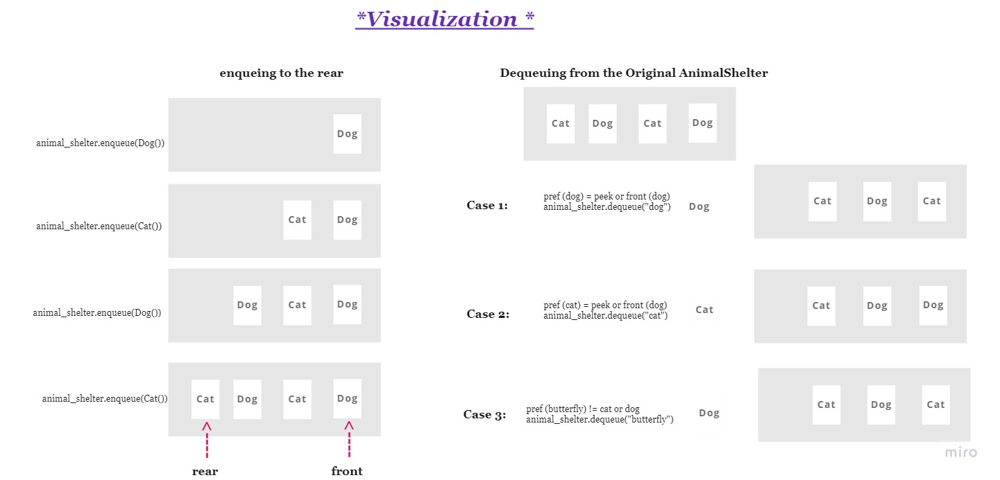
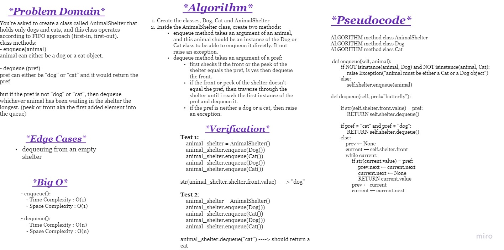
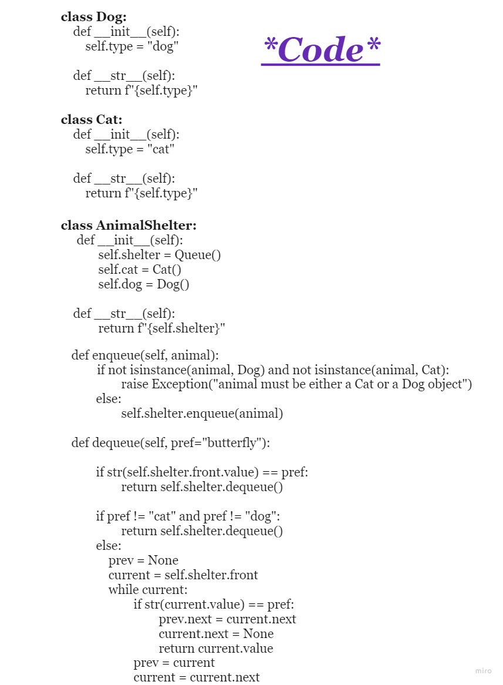

# **Challenge Summary**
Create a class called AnimalShelter that holds only dogs and cats, and this class operates according to FIFO approach (first-in, first-out).

class methods:

- enqueue(animal)
animal can either be a dog or a cat object.

- dequeue (pref)
pref can either be "dog" or "cat"
and it would return the pref

but if the pref is not "dog" or "cat", then dequeue whichever animal has been waiting in the shelter the longest. (peek or front aka the first added element into the queue)

 

## **Whiteboard Process**

 

 

## **Approach & Efficiency**

**Approach:** FIFO (first in first out), according to the queue

**Big O:** 

- enqueue():
    - Time Complexity : O(1)

    - Space Complexity : O(1)

- dequeue():
    - Time Complexity : O(n)

    - Space Complexity : O(n)

 

## **Solution**
the solution is in the ***animal_shelter.py*** file
and the tests are in ***test_animal_shelter.py***
