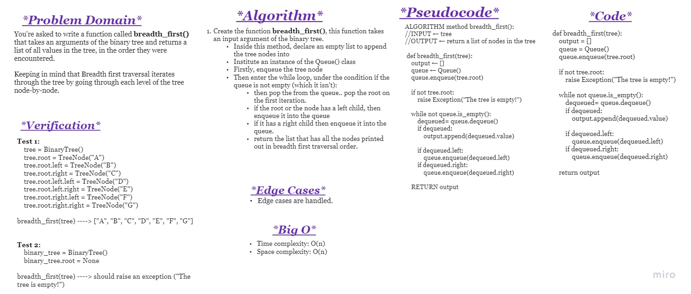
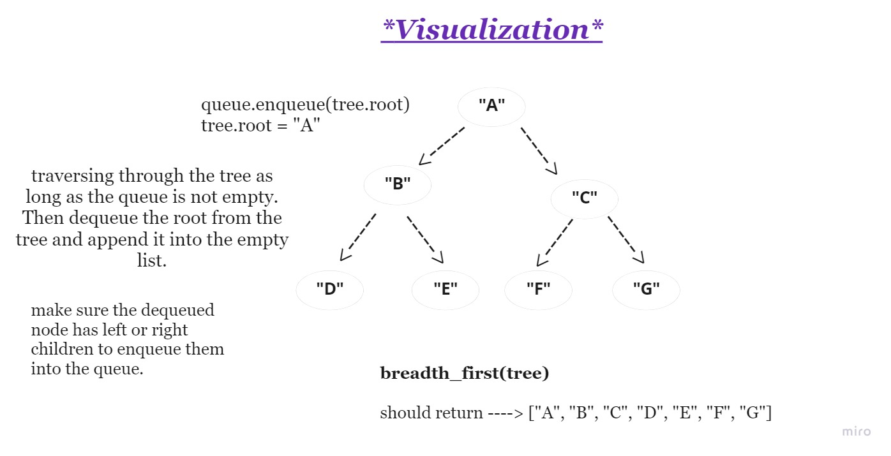

# **Challenge Summary**

You're asked to write a function called breadth_first that takes an arguments of the binary tree and returns a list of all values in the tree, in the order they were encountered.

Keeping in mind that Breadth first traversal iterates through the tree by going through each level of the tree node-by-node.

 

## **Whiteboard Process**

 

## **Approach & Efficiency**

***Approach:***

Uses a queue (instead of the call stack via recursion) to traverse the width/breadth of the tree. 
  

***Big O:***

- Time Complexity: O(n) 
- Space Complexity: O(n) 

## **Solution**

The solution is in ***breadth_first.py*** file and the test cases are in ***test_breadth_first.py***