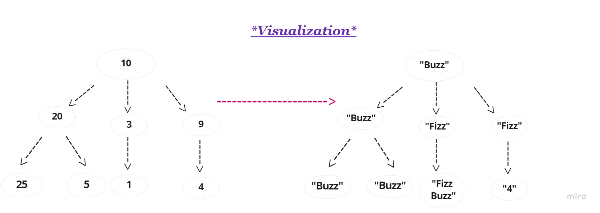
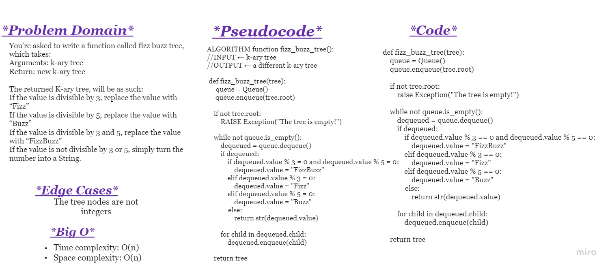

# **Challenge Summary**
You're asked to write a function called fizz buzz tree, which takes:
Arguments: k-ary tree
Return: new k-ary tree

The returned K-ary tree, will be as such:

- If the value is divisible by 3, replace the value with “Fizz”
- If the value is divisible by 5, replace the value with “Buzz”
- If the value is divisible by 3 and 5, replace the value with “FizzBuzz”
- If the value is not divisible by 3 or 5, simply turn the number into a String.

 

## **Whiteboard Process**

 

## **Approach & Efficiency**

The approach is to traverse the tree, and replace the value with the appropriate string.

**Big O:**

- Time complexity: O(n) 

- Space complexity: O(n)

 

## **Solution**
<!-- Show how to run your code, and examples of it in action -->