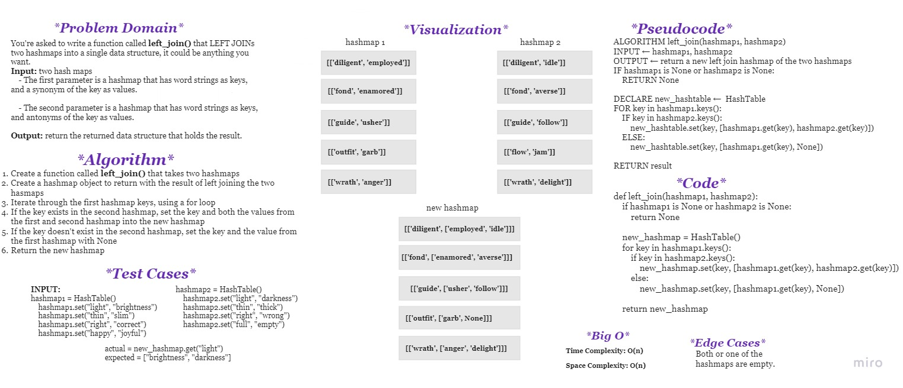

# **Hashmap LEFT JOIN**

It means that the left table is joined with the right table on the basis of the key. All the values in the first hashmap are returned, and if values exist in the “right” hashmap, they are appended to the result row.

If no values exist in the right hashmap, then some flavor of NULL should be appended to the result row.

 

## **Challenge**
You're asked to write a function that LEFT JOINs two hashmaps into a single data structure, it could be anything you want.

**Input:** two hash maps

    - The first parameter is a hashmap that has word strings as keys, and a synonym of the key as values.

    - The second parameter is a hashmap that has word strings as keys, and antonyms of the key as values.

**Output:** return the returned data structure that holds the result.

 

## **Whiteboard Process**

 

## **Approach & Efficiency**

### **Approach 1:**

    - Iterate through the first hashmap, and for each key, check if the key exists in the second hashmap.
    - If it does, add the key and the values from the first hashmap and the second to the result hashmap.
    - If it doesn't, add the key and the value from the first hashmap and a None value to the result hashmap.
    - Return the result hashmap.

### **Approach 2:**

    - Iterate through the first hashmap, and for each key, check if the key exists in the second hashmap.
    - If it does, append the key and the values from the first hashmap and the second to the result hashmap.
    - If it doesn't, append the key and the value from the first hashmap and a None value to the result hashmap.
    - Return the result list.

 

## **Solution**

solution: [hashmap_left_join.py](hashmap_left_join/hashmap_left_join.py)

Tests: [test_hashmap_left_join.py](tests/test_hashmap_left_join.py)