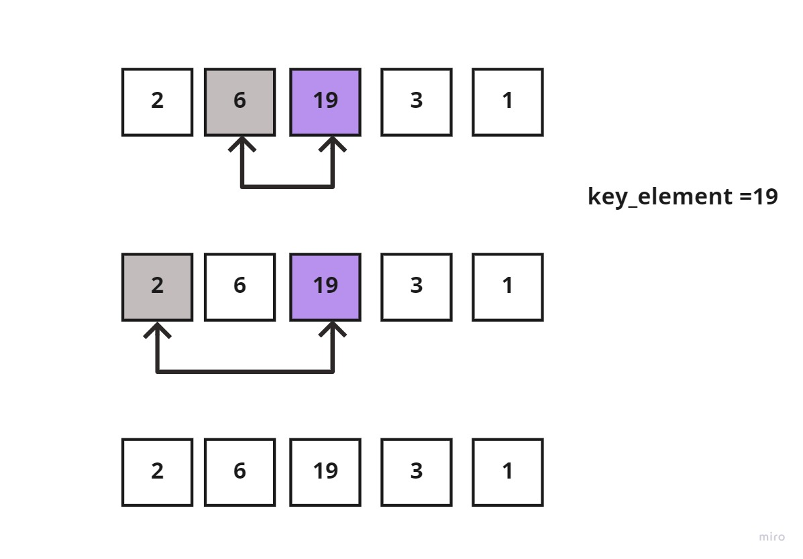

## **What Are Sorting Algorithms?**

Sorting algorithms are what we use to arrange the elements of an array aka list, in a specific order according to a comparison operator on the elements. The comparison operator is used to decide the new order of element in the respective data structure. The new order, could be of ascending, descending order, or even by alphabetical order.


 
In this image we see that a sorting algorithm takes an array or list as an input, performs some kind of comparison operations on it and produce the sorted list in a specific order; ascendingly 


### **The Importance of Sorting Algorithms**

Sorting Algorithms comes in handy when we have a specific aim to achieve while looking at a data structure, because as long as the given data structure is sorted or ordered in such a way, the process of getting what we want is made much easier and faster.

To sum it up in bullet-points, the importance of sorting algorithms are:

1. Searching for a specific element in a given array/list is much faster.

2. Selecting elements from an array/list based on their relation to the other elements of the same list is made easier.

3. Finding duplicate elements in an array/list is made easier and faster.

4. Analyzing the frequency distribution of the elements, meaning; which elements appear more or less in an array/list. Now is very fast with sorting algorithms.


### **Types of Sorting Algorithms:**

1. Insertion Sort 
2. Merge Sort 
3. Quick Sort
4. Selection Sort
5. Bubble Sort
6. Heap Sort
7. Radix Sort
8. Bucket Sort

In this article, I'm going to be explaining the ***Insertion Sort***.

<br>

## **What Is Insertion Sort?**

Insertion sort is an easy to implement sorting algorithm, that is mostly used for nearly-sorted or small data sets but on data sets with a large number of elements it would be the worst choice. 

It builds the sorted list one element at a time by comparing each element with the rest of the list and ***inserting*** it into its correct position each iteration. Hence the name ***insertion***.
Building the sorted list is done by shifting smaller elements to the left. Which means it arranges them in an increasing order (ascendingly) 

### **Insertion Sort Properties** 

- **In-place:** Insertion sort requires a small, additional space regardless of the input size of the collection. After it's finished sorting, it re-writes the original memory locations of the elements in the collection.

- **Stable:** Insertion sort does a good job at maintaining the order of equal keys in the unsorted list; the keys that have equal values aren't re-ordered.

The image below, you can see an unsorted list with equal keys of 2. An unstable sorting algorithm of the list, may or may not maintain the original positions for the equal keys .


Whereas, for a stable sorting algorithm, such as ***insertion sort*** the original position of both the equal keys would be maintained. 


- **Adaptive:** Insertion sort is appropriate for nearly-sorted or small data sets.

- **Convenient:** Insertion sort doesn't get hurdled by adding new elements to the list. Because it doesn't start sorting by knowing each list element in advance, but rather it receives one element at a time, and when adding new elements, it simply orders them in their proper place without starting from scratch.

- **Practical:** Insertion sort is used quite often in real world problems, because of how efficient it is for small data sets.


<br>

### **How Does Insertion Sort Work?**

It starts with figuratively splitting the array into two parts: a ***sorted subarray*** , and an ***unsorted subarray*** .

The ***sorted subarray***  is initially made up of only the first element of the original array, while the rest of the elements reside in the ***unsorted subarray*** . The first element of the unsorted subarray is then compared to the elements in the sorted subarray (in the first iteration, there's only one element in the sorted array) to place or order that unsorted element into its proper place in the sorted subarray.


This is done by checking if the right-side element is smaller than the left-side element, then moving the large element to the right and inserting the smaller one into the left. This would repeatedly happen until all elements in the unsorted subarray are inserted into their appropriate place in the sorted subarray.

So, what is the algorithm of insertion sort?

### **Algorithm**

1. Split the list into two parts; sorted and unsorted by iterating from the first element to the last element of the ***unsorted list***. Assuming that the first element in the ***sorted list*** is already sorted.

2. Declare a **key element** variable to store the element that you're trying to position in its proper place during each iteration. Which will be the first element in the ***unsorted subarray*** on the first iteration.

3. Declare another variable that points to the elements which reside to the left side of the **key element**, aka the elements in the ***sorted list***, to compare them to each other on each iteration.

4. Initiate a while loop that compares the values of the **key element** and the elements to its left, to see which is smaller 

5. If the element in the ***sorted sublist*** is smaller than the **key element** then move to the next element to keep comparing.

6. If the **key element** is smaller, then shift the larger elements to the right and insert the **key element** into its proper place.

7. Repeat until all elements are placed into their proper place.


### **Pseudocode**

```
insertion_sort(int[] arr)
    DECLARE n <-- arr.Length;
    FOR i = 1; i to n - 1  
        DECLARE key_element <-- i;
        DECLARE left_to_the_key_element <-- i - 1;
        WHILE left_to_the_key_element >= 0 and key_element < arr[left_to_the_key_element]
            arr[left_to_the_key_element + 1] <-- arr[left_to_the_key_element];
            left_to_the_key_element <-- left_to_the_key_element - 1;
        END WHILE;
        arr[left_to_the_key_element + 1] <-- key_element;
    END FOR;
    RETURN arr;
END insertion_sort;
``` 

<br>

### **Visualization of Insertion Sort**

Now let's trace the following array: **[6,2,19,3,1]**

We start off by splitting the list into two sublists, as described before.


Start iterating through the unsorted sublist, and store the first element into a ***key_element*** variable. Which in this case would be = 2, and compare it to the element to its left (the sorted list element which is =6)


2 < 6, then shift 6 to the right.


Since there are no elements left in the ***sorted sublist*** to compare the  ***key_element*** with, insert the ***key_element*** to index zero of the ***sorted sublist***


The new list would be split as such:


In the next iteration, the ***key_element*** = 19, which is greater than both 6 and 2, then it would remain in the same position. 



The new list would be again, split as such:
 


And moving on to the next element in the unsorted sublist, the ***key_element*** =3, and we have to compare it to each element in the sorted sublist, one element at a time. 

Since 3 < 19, I would shift 19 to the right and continue comparing 3 to the next element in the sorted sublist which is 6; 3<6 then also shift 6 to the right. 

Next, comparing 3 and 2, 3>2 then keep 2 at its position and insert 3 to its right. The following image demonstrates what was said:


Lastly, comparing the last element in the ***unsorted sublist*** to all elements in the ***sorted sublist***, would go as such:


Now, the sorting insertion is complete since each element is in its proper place.

<Br>

### **Python Code Implementation**

```
def insertion_sort(array):
    n = len(array)
    for i in range(1, n):
        key_element = array[i]
        left_to_the_key_element = i - 1
        while left_to_the_key_element >= 0 and key_element < array[left_to_the_key_element]:
            array[left_to_the_key_element + 1] = array[left_to_the_key_element]
            left_to_the_key_element -= 1
        array[left_to_the_key_element + 1] = key_element

    return array
```

<br>

### **Efficiency And Big(O) Notation**

**Big(O) Notation** is used to describe the efficiency of an algorithm or function. This efficiency is evaluated based on 2 factors:

- Running Time (Time Complexity):
Which explains the amount of time a function or an algorithm needs to complete.

- Memory Space (Space Complexity):
Explains the amount of memory resources a function or an algorithm uses to store data.


In order to analyze the above limiting factors, we should consider 4 key areas for analysis, which are:

1. Input Size
2. Units of Measurement
3. Orders of Growth
4. Best Case, Average Case, and Worst Case

Thus, the efficiency of any sorting algorithm is determined by the time and space complexities of the algorithm. And with insertion sort it's no different, and they go as follows:


| Time Complexity |
| ----------- |
| Best: 	O(n)|
| Average:   O(n^2)|
| Worst:   O(n^2)|

| Space Complexity |
| ----------- |
| O(1)|

The insertion sort algorithm has 2 nested loops. And while the inner loop is considered to be efficient because it only goes through the list until it finds the correct position of an element. But still, the algorithm has an O(n^2) runtime complexity on the average scenario.

#### To explain each case or scenario of the Time Complexity:

- **Best Case Complexity**: This happens when the array or list is already sorted, only running the outer loop for n number of times while the inner loop is never executed. Thus, O(n).

- **Average Case Complexity**: This happens when the array elements are in jumbled order; meaning they're neither in ascending or descending. Thus, O(n^2)

- **Worst Case Complexity**: This happens when the array or list element are sorted in a reverse order of the order you're asked to sort them in, suppose the array is in descending order and you're asked to sort it in an ascending order. 
This would require executing the inner loop on every iteration to compare each element to the other elements.  Thus, O(n^2)

#### Space Complexity: 

The space complexity is of O(1). That's because in insertion sort, an extra variable key is used for swapping the list elements.

<br>

### **Unit Tests**
```
from insertion_sort.insertion_sort import insertion_sort


# Reverse-sorted: [20,18,12,8,5,-2]
def test_insertion_sort_reverse_sorted():
    actual = insertion_sort([20, 18, 12, 8, 5, -2])
    expected = [-2, 5, 8, 12, 18, 20]
    assert actual == expected


# Few uniques: [5,12,7,5,5,7]
def test_insertion_sort_few_uniques():
    actual = insertion_sort([5, 12, 7, 5, 5, 7])
    expected = [5, 5, 5, 7, 7, 12]
    assert actual == expected


# Nearly-sorted: [2,3,5,7,13,11]
def test_insertion_sort_nearly_sorted():
    actual = insertion_sort([2, 3, 5, 7, 13, 11])
    expected = [2, 3, 5, 7, 11, 13]
    assert actual == expected


# Sorted: [0,1,2,3,4,5]
def test_selection_sort_sorted():
    actual = insertion_sort([0, 1, 2, 3, 4, 5])
    expected = [0, 1, 2, 3, 4, 5]
    assert actual == expected


# [2,0,-2,3,90,12]
def test_selection_sort_one():
    actual = insertion_sort([2, 0, -2, 3, 90, 12])
    expected = [-2, 0, 2, 3, 12, 90]
    assert actual == expected


# [8,4,23,42,16,15]
def test_selection_sort_two():
    actual = insertion_sort([8, 4, 23, 42, 16, 15])
    expected = [4, 8, 15, 16, 23, 42]
    assert actual == expected
```
