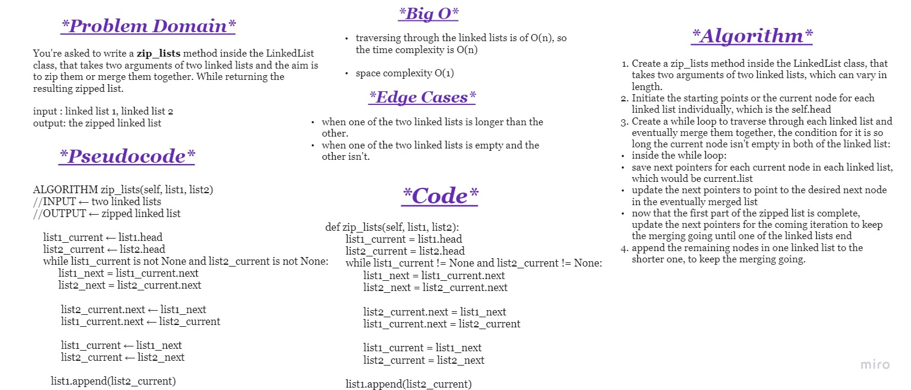
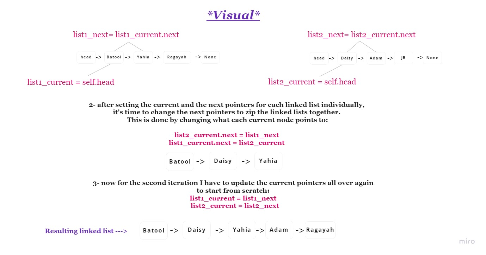
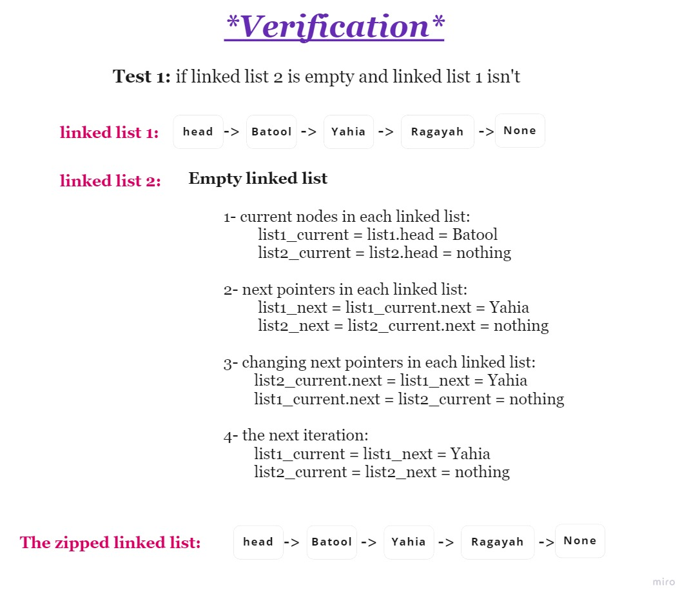

# Challenge Summary

You're asked to write a zip_lists function that takes two arguments of two linked lists and the aim is to zip them or merge them together. While returning the resulting zipped list.

**input**: linked list 1, linked list 2

**output**: the zipped linked list

 

## Whiteboard Process

 

## Approach & Efficiency

The **approach** taken was to determine the start node in each linked list, which would be from the self.head and then set an inital value to next pointer in each linked list individually. 
But then update the next pointers to the desired zipped linked list I want to get.

 

**Big O:**

**Time complexity** is of O(n) because I would have to traverse through each linked list.

**Space complexity** is of O(1)

 

## Solution
The solution and tests are all in the python file and also in the whiteboard images.
