# **What Are Sorting Algorithms?**

Sorting algorithms are what we use to arrange the elements of an array aka list, in a specific order according to a comparison operator on the elements. The comparison operator is used to decide the new order of element in the respective data structure. The new order, could be of ascending, descending order, or even by alphabetical order.


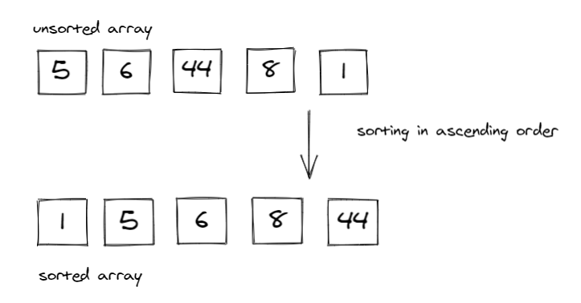

In this image we see that a sorting algorithm takes an array or list as an input, performs some kind of comparison operations on it and produce the sorted list in a specific order; ascendingly.

<br>


## **The Importance of Sorting Algorithms**

Sorting Algorithms comes in handy when we have a specific aim to achieve while looking at a data structure, because as long as the given data structure is sorted or ordered in such a way, the process of getting what we want is made much easier and faster.

To sum it up in bullet-points, the importance of sorting algorithms are:

1. Searching for a specific element in a given array/list is much faster.

2. Selecting elements from an array/list based on their relation to the other elements of the same list is made easier.

3. Finding duplicate elements in an array/list is made easier and faster.

4. Analyzing the frequency distribution of the elements, meaning; which elements appear more or less in an array/list. Now is very fast with sorting algorithms.


## **Types of Sorting Algorithms:**
1. Insertion Sort
2. Merge Sort
3. Quick Sort
4. Selection Sort
5. Bubble Sort
6. Heap Sort
7. Radix Sort
8. Bucket Sort

In this article, I'm going to be explaining **Merge Sort** after I have explained [Insertion Sort](https://batoolragayah.hashnode.dev/sorting-algorithms-insertion-sort) before.

<br>

# **What is Meant By Merge Sort?**

Merge sort is an efficient sorting algorithm, that follows the *Divide and Conquer Algorithm*, which is considered to be a great resort for simplifying complicated problems.

<br>

## **Defining Divide and Conquer Algorithm**

As the name suggests, divide and conquer algorithm focuses on breaking down a complex problem into sub-problems, solving those sub-problems separately, then combining the solutions into a whole again, which will then help solve the main problem. 

In retrospect, this algorithm takes big use of recursion, which is usually expressed by a function calling itself to solve each subproblem until it reaches a base case.

The steps to the divide and conquer algorithm could be summarized in the following steps and image below:

- **Dividing:** Breaking down the complex problem into smaller sub-problems.
- **Conquering:** Solving the sub-problems by taking use of recursion until they're solved.
- **Combining:** Merging the solution to the sub-problems together to solve the main problem.

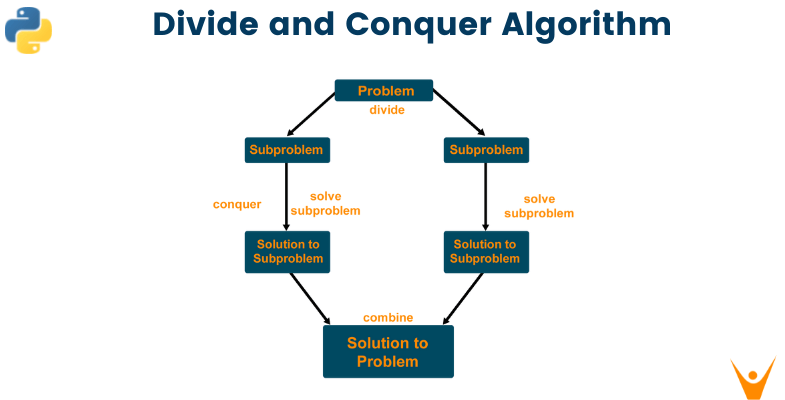

<br>

## **Merge Sort Properties**

**Stable:**  Merge sort does a good job at maintaining the order of equal keys in the unsorted list; the keys that have equal values aren't re-ordered. 

**Not adaptive**: Merge sort is not appropriate for nearly-sorted or small data sets.

**Useful for sorting linked lists:** Merge sort can be implemented without extra space for linked lists.

**Requires extra space for arrays:** Merge sort requires additional memory space of O(n) for the temporary array.

<br>

## **How Merge Sort Work?**

After defining the divide and conquer algorithm, it is important to mention how identical the procedure is for the both of them. 

As the merge sort algorithm ***divides*** the given array/list into two halves, ***calls itself*** for the two halves and then ***merges*** the two sorted halves. Noting that, prior to the final merge of the sorted two halves, the initial two sub-lists are **divided** again and again into halves until the list cannot be divided any further, and each of the halves would be solved (sorted) individually, then combined to solved the larger (main array).

<br>


## **Algorithm**

1. Declare two functions; ***merge_sort()*** that is mainly responsible for splitting the main array into halves then later on, merges them by calling the other function; ***merge()***, which does the comparison of each sub-list element in each half to make sure to sort out those elements into their correct place.

2. In ***merge_sort()***, declare a variable to store the length of the list. Create an if statement, that if the length is greater than one, then "halve" the array into left and right.

3. If the array's length is greater than 1, call  ***merge_sort()*** on each half (left and right respectively), and what this does is, it halves the already halved sub-arrays until they can no longer be halved. Which will then call out for ***merge()*** on the the left, right and the array of that sub problem to merge and sort it.

4. Inside ***merge()***, declare variables for indices in the left, right and the main array, to compare the values if they're greater or smaller and based on that comparison sort the elements in each sub-list until we get to the main list.

5. The latter can be done by declaring while loops and if/else statements, that will eventually result in the main array in a sorted manner after merging all its halves.

6. Return the new sorted and merged array.

<br>

## **Visualization of Merge Sort**
As can be seen in the images below, this is how Merge Sort works, keeping in mind that because of the use of recursion we would always strive to reach a base case to stop the function calling, and in this algorithm the base case is; when the sub-list could no longer be halved.

Starting with giving the merge_sort() function the main array of [8, 4, 23, 42, 16, 15]:


Which in return would halve it into two sub-arrays; left [8, 4, 23] and right [42, 16, 15]:

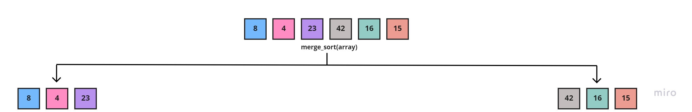

Then, the left and right sub-arrays would be halved again, and the process would continue until the sub-lists could no longer be halved.

And because we're using recursion, we'd continue to call merge_sort() function on each half, beginning with the left half sub-array [8, 4, 23], resulting in two new halves:

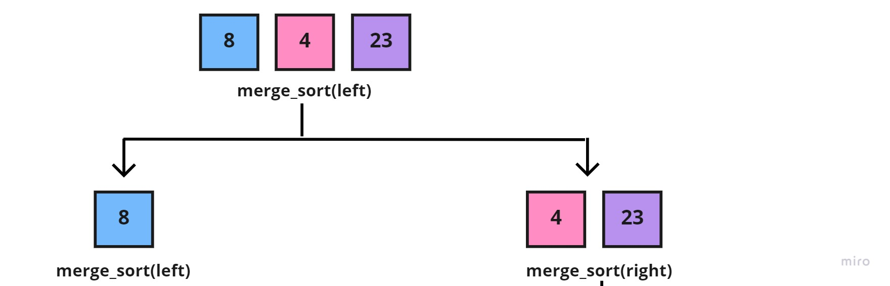

Again, we'd call the merge_sort() function on the new halves, but since the left half [8] is a base case (can't be halved), then we'd focus on the right half [4, 23], which in return would also be halved into:

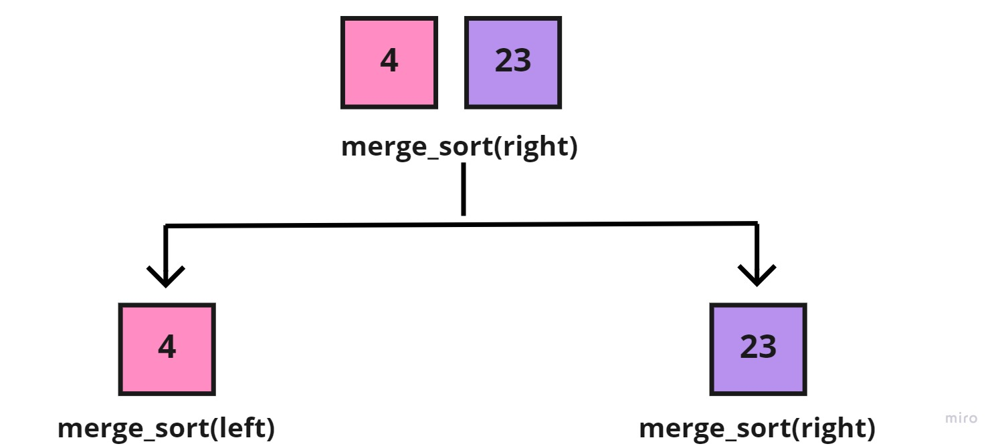

Now, that the sub-array of [4, 23], has reached a base case for the two halves, we'd call the merge() function to take the sub-array [4, 23], the left [4], and right halves [23], to merge them together, each element in its correct place:

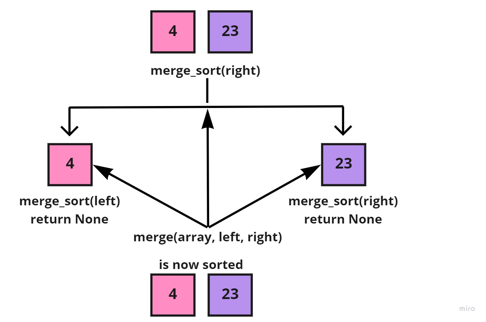

After, the whole right side [4, 23] of the sub-array [8, 4, 23] is sorted into [4, 23]. We'd call the merge() function to take both the sub-array [8, 4, 23], the left [8], and the sorted right [4, 23], to also merge each element in its correct place:

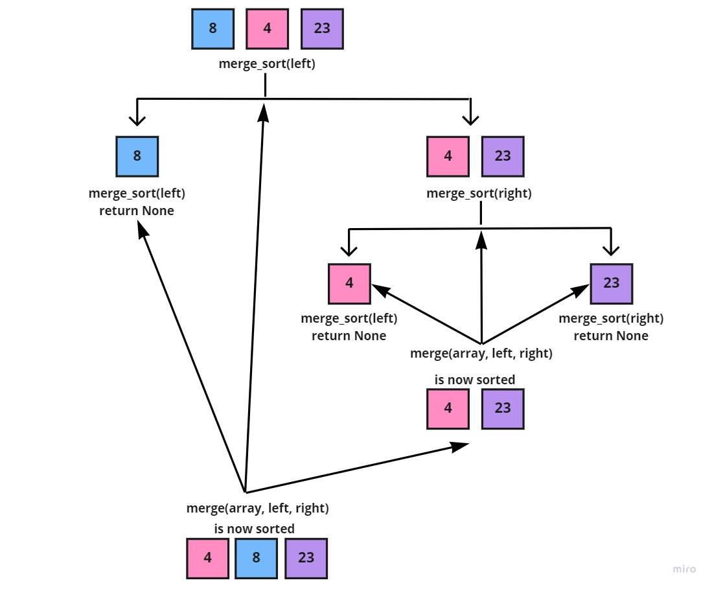


The previous image shows the latest, merged and sorted left sub-array; [4, 8, 23] of the main array. And since the whole left side is completed, we'd move on to the right side, following the recursion approach:

Where we would call the merge_sort() function on the right half [42, 16, 15] to break it into two sub-arrays:

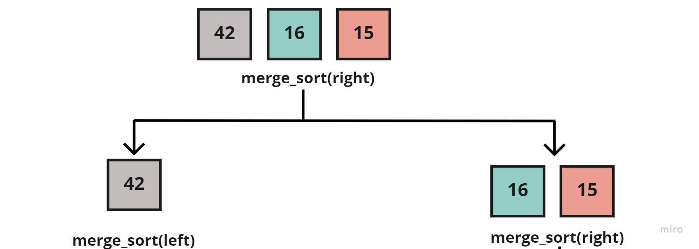


After which, we'd call the merge_sort() function on the two new halves, but since the left half [42] is a base case (can't be halved), then let's focus on the right half [16, 15], which in return would also be halved into:

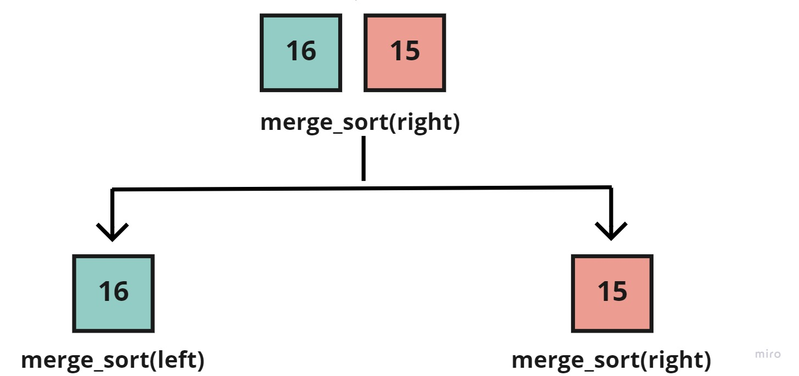


Now, that the sub-array of [16, 15], has reached a base case for the two halves, we'd call the merge() function to take the sub-array [16, 15], the left [16], and right halves [15], to merge them together, each element in its correct place:

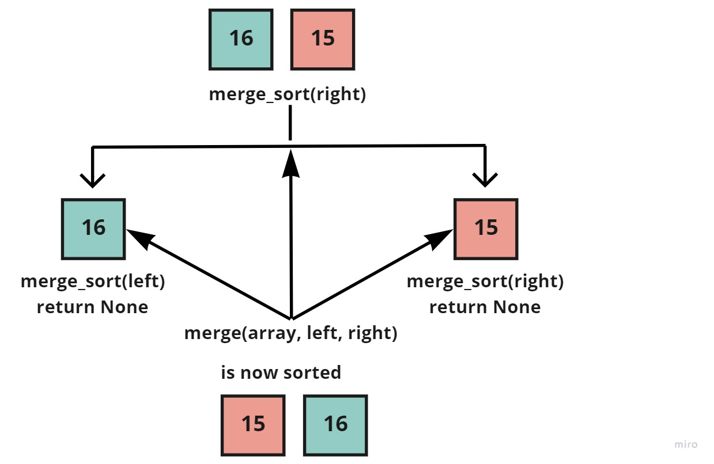

And as can be seen above, the right side [16, 15] of the sub-array [42, 16, 15] is sorted into [15, 16]. So we'd now call the merge() function to take both the sub-array [42, 16, 15], the left [42], and the sorted right [15, 16], to also merge each element in its correct place:

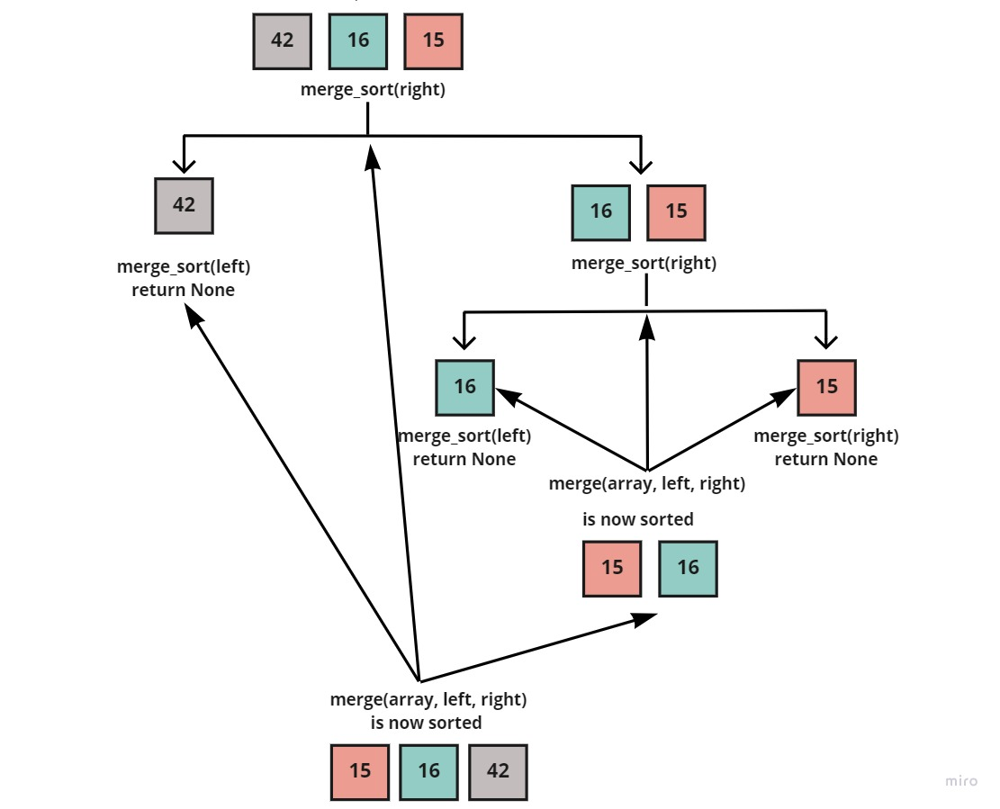

Resulting in, the right side being sorted into: [15, 16, 42]

And lastly, since both the left half [4, 8, 23] and the right half [15, 16, 42] are sorted individually. Then we'd call the merge() function on the main array [8, 4, 23, 42, 16, 15] and the now sorted halves:


Which return the fully sorted and merged array; [4, 8, 15, 16, 23, 42]
<br>

## **Pseudocode**

```
ALGORITHM Mergesort(arr)
    DECLARE n <-- arr.length

    if n > 1
      DECLARE mid <-- n/2
      DECLARE left <-- arr[0...mid]
      DECLARE right <-- arr[mid...n]
      // sort the left side
      Mergesort(left)
      // sort the right side
      Mergesort(right)
      // merge the sorted left and right sides together
      Merge(left, right, arr)
   
   RETURN arr

ALGORITHM Merge(left, right, arr)
    DECLARE i <-- 0
    DECLARE j <-- 0
    DECLARE k <-- 0

    while i < left.length && j < right.length
        if left[i] <= right[j]
            arr[k] <-- left[i]
            i <-- i + 1
        else
            arr[k] <-- right[j]
            j <-- j + 1

        k <-- k + 1

    if i = left.length
       set remaining entries in arr to remaining values in right
    else
       set remaining entries in arr to remaining values in left

    RETURN arr
``` 

<br>

## **Python Code Implementation**

```
def merge_sort(array):
    length = len(array)
    if length > 1:
        mid = length // 2
        left = array[:mid]
        right = array[mid:]
        merge_sort(left)
        merge_sort(right)
        merge(left, right, array)
    return array


def merge(left, right, array):
    i = 0
    j = 0
    k = 0
    while i < len(left) and j < len(right):
        if left[i] <= right[j]:
            array[k] = left[i]
            i += 1
        else:
            array[k] = right[j]
            j += 1
        k += 1

    if i == len(left):
        array[k:] = right[j:]
    else:
        array[k:] = left[i:]

    return array
``` 

<br>

## **Efficiency And Big(O) Notation**

**Big(O) Notation** is used to describe the efficiency of an algorithm or function. This efficiency is evaluated based on 2 factors:

- **Running Time (Time Complexity):** Which explains the amount of time a function or an algorithm needs to complete.

- **Memory Space (Space Complexity):** Explains the amount of memory resources a function or an algorithm uses to store data.

In order to analyze the above limiting factors, we should consider 4 key areas for analysis, which are:

1. Input Size
2. Units of Measurement
3. Orders of Growth
4. Best Case, Average Case, and Worst Case

Thus, the efficiency of any sorting algorithm is determined by the time and space complexities of the algorithm. And with merge sort it's no different, and they go as follows:

| Case | Time Complexity |
| ----------- | ----------- |
|**Best Case:** The array is already sorted.| O(n*logn) |
|**Average Case: **The array elements are in a jumbled order that is neither ascending nor descending.| O(n*logn) |
|**Worst Case:** The array elements are required to be sorted in reverse order.| O(n*logn) |

| Space Complexity |
| -----------|
|O(n) |


The Merge Sort has two functions; 

- **merge()**: Receives the left, right and the array, and looks it at each element to sort them in the correct order, which would give it O(n).

- **merge_sort()** takes an array as an input and halve it into sub-arrays which would give it a O(logn). 

And combined together, the total run time is O(n*logn).

Because Merge Sort requires equal amount of additional space as the unsorted array. That's why its space complexity is of O(n).

<br>

## **Unit Tests**

```
from merge_sort.merge_sort import merge_sort


# Reverse-sorted: [20,18,12,8,5,-2]
def test_merge_sort():
    actual = merge_sort([20, 18, 12, 8, 5, -2])
    expected = [-2, 5, 8, 12, 18, 20]
    assert actual == expected


# Few uniques: [5,12,7,5,5,7]
def test_merge_sort_few_uniques():
    actual = merge_sort([5, 12, 7, 5, 5, 7])
    expected = [5, 5, 5, 7, 7, 12]
    assert actual == expected


# Nearly-sorted: [2,3,5,7,13,11]
def test_merge_sort_nearly_sorted():
    actual = merge_sort([2, 3, 5, 7, 13, 11])
    expected = [2, 3, 5, 7, 11, 13]
    assert actual == expected


def test_merge_sort_empty():
    actual = merge_sort([])
    expected = []
    assert actual == expected


# Negative & unsorted elements: [-2, -1, -3, -4, -5]
def test_merge_sort_negatives():
    actual = merge_sort([-2, -1, -3, -4, -5])
    expected = [-5, -4, -3, -2, -1]
    assert actual == expected
```

<br>

# **Resources**


[Sorting Algorithms in Python](https://realpython.com/sorting-algorithms-python/#the-merge-sort-algorithm-in-python)

[Divide and Conquer Algorithm](https://www.programiz.com/dsa/divide-and-conquer)

[Merge Sort Algorithm](https://www.javatpoint.com/merge-sort)

