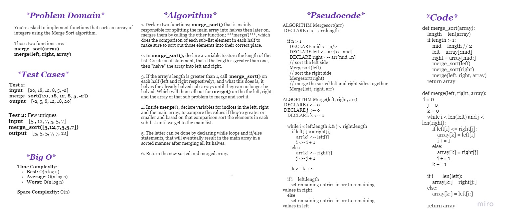

# **Challenge Summary**

Merge Sort Algorithm, You're asked to implement functions that sorts an array of integers using the Merge Sort algorithm. 

Those two functions are:

```
merge_sort(array)
merge(left, right, array)
```

<br>

## **Whiteboard Process**



<br>


## **Approach & Efficiency**

**Approach:**

    - Divide the array into two halves
    - Sort the two halves
    - Merge the two sorted halves


**Efficiency:**

    - Time Complexity: O(n log n)
    - Space Complexity: O(n)

<br>

## **Solution**

The solution using the divide and conquer approach can be found in the file [merge_sort.py](merge_sort.py).


<br>

## **Blogs**

Hashnode: [Sorting Algorithms: Merge Sort](https://batoolragayah.hashnode.dev/sorting-algorithms-merge-sort)

README.md: [BLOG.md](BLOG.md)


