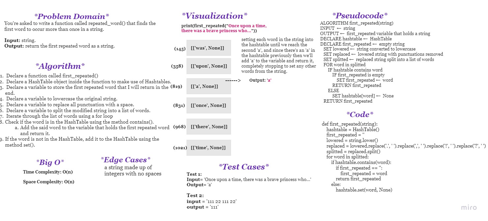

# **Challenge Summary**
You're asked to write a function called repeated_word() that finds the first word to occur more than once in a string.

- **Input:** string.
- **Output:** return the first repeated word as a string.

 

## **Whiteboard Process**

 

## **Approach & Efficiency**

### **Approach:**

The approach for first repeated word is to use a hash table to store the words. Then, iterate through the string and check if the word is already in the hash table. If it is, return the first repeated word.

### **Efficiency:**

- **Time Complexity:** O(n)

- **Space Complexity:** O(n)

 

## **Solution**

The solution could be found in: [repeated_word](repeated_word/repeated_word.py)

The tests for this challenge can be found in: [test_repeated_word.py](tests/test_repeated_word.py)
