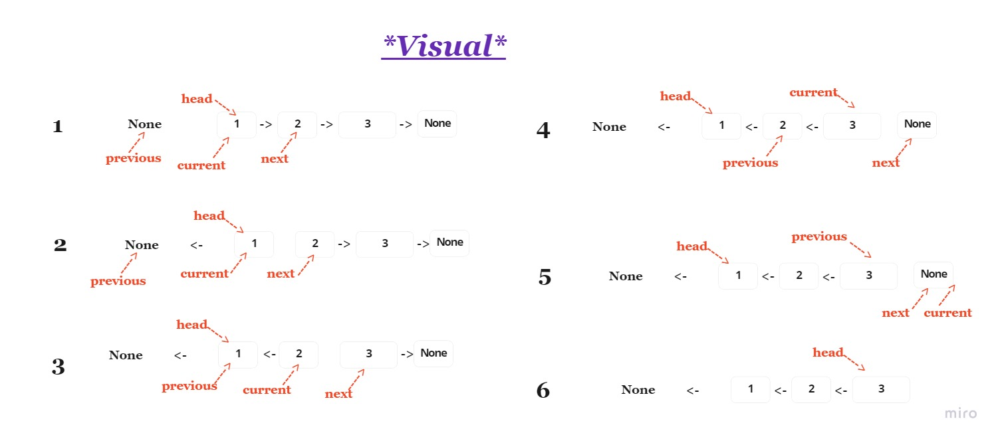
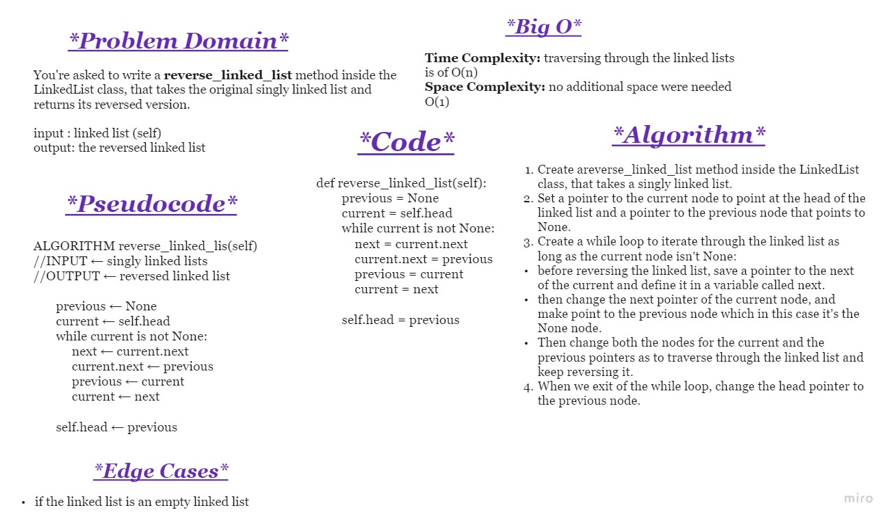
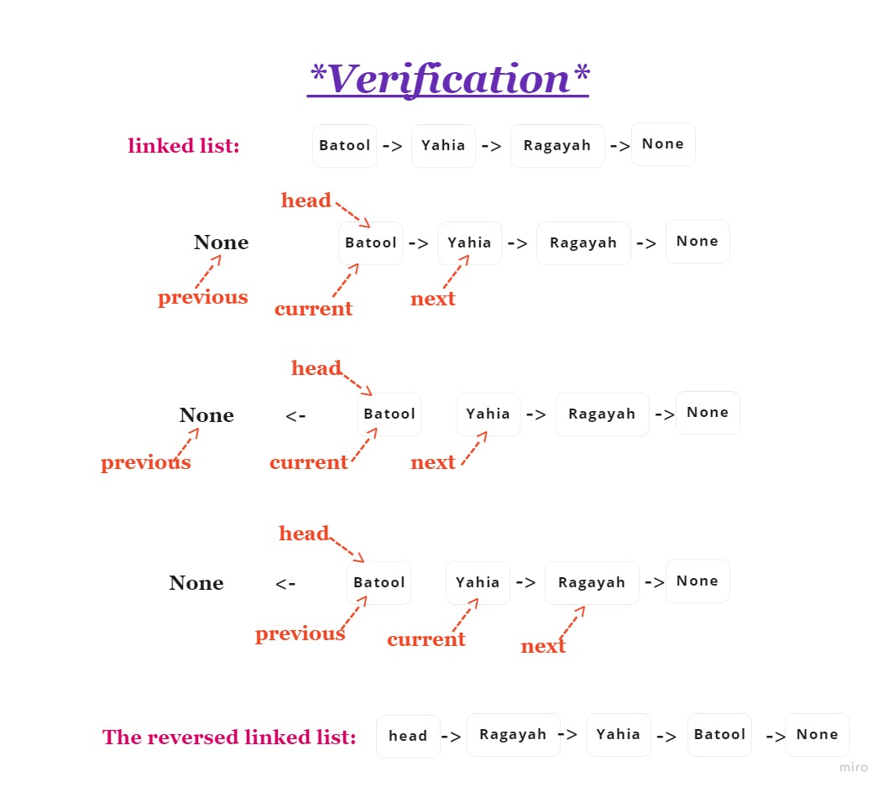

## Challenge

You're asked to write a reverse_linked_list method inside the LinkedList class, that takes the original singly linked list and returns its reversed version.

input : linked list (self)
output: the reversed linked list
 

## Approach & Efficiency
- The approach: 

Create areverse_linked_list method inside the LinkedList class, that takes a singly linked list.

Set a pointer to the current node to point at the head of the linked list and a pointer to the previous node that points to None.

Create a while loop to iterate through the linked list as long as the current node isn't None:
before reversing the linked list, save a pointer to the next of the current and define it in a variable called next.

then change the next pointer of the current node, and make point to the previous node which in this case it's the None node.

- Time Complexity: traversing through the linked lists is of O(n) 
- Space Complexity: no additional space were needed O(1)

 

## Whiteboard Process

 
