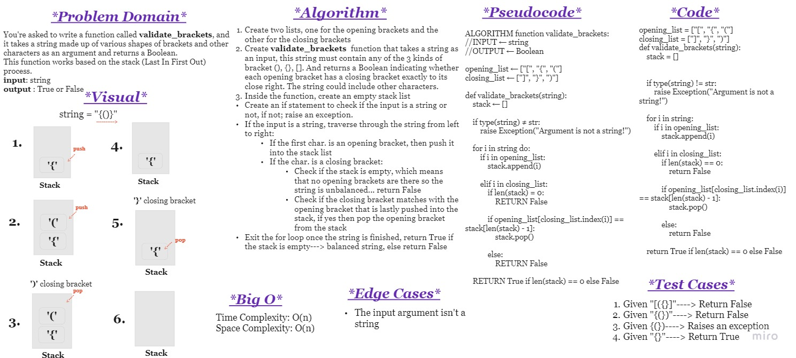

# Challenge Summary

You're asked to write a function called **validate_brackets**, and it takes a string made up of various shapes of brackets(),[],{} and other characters as an argument and returns a Boolean.

This function works based on the stack (Last In First Out) process.

**input:** string
**output:** True or False

 

## Whiteboard Process

 

## Approach & Efficiency

**Approach:**

Push opening brackets into the stack, and only pop the last added bracket if the closing bracket is next to the opening bracket in the string order.

Last In First Out (LIFO) stack approach

 

**Big O:**

Time Complexity: O(n)
Space Complexity: O(n)

 

 

## Solution

The solution is provided in the file **stack_queue_brackets.py**

And the tests for the function are provided in the file **test_stack_queue_brackets.py**