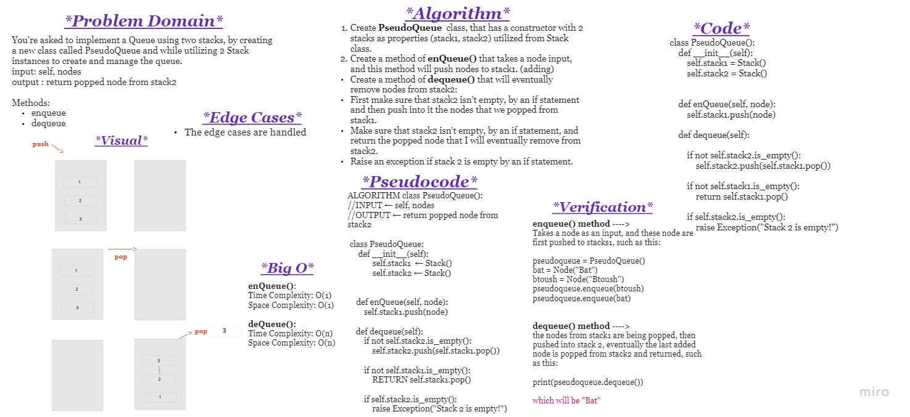

# Challenge Summary

You're asked to implement a Queue using two stacks, by creating a new class called PseudoQueue and while utilizing 2 Stack instances to create and manage the queue.
input: self, nodes
output : return popped node from stack2

Methods:
enqueue
dequeue

 

## Whiteboard Process

 

## Approach & Efficiency

**The approach:**

Create 2 stacks with the help of Stack class, push nodes into stack1 and reverse it in stack2.

whereas the enqueue method of PseudoQueue class will be pushing into stack1.

And dequeue is popping from stack1, pushing into stack2, then popping one node by one and returning the last added node.

 

**Big O space/time for this approach**

enqueue():

- Time Complexity: O(1)
- Space Complexity: O(1)

dequeue():

- Time Complexity: O(n)
- Space Complexity: O(n)

 

## Solution

enqueue() that takes a node input, and this method will push nodes to stack1. (adding using a first-in, first-out approach)

dequeue() that will eventually remove nodes from stack2, by popping what was pushed into it from stack1 (using a first-in, first-out approach.)
