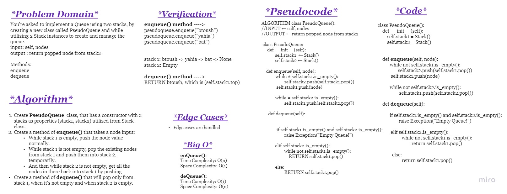
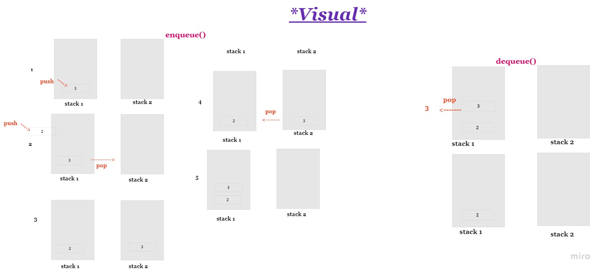

# **Challenge Summary**

You're asked to implement a Queue using two stacks, by creating a new class called PseudoQueue and while utilizing 2 Stack instances to create and manage the queue.
input: self, nodes
output : return popped node from stack2

Methods:
enqueue
dequeue

 

## **Whiteboard Process**

 

## **Approach & Efficiency**

**The approach:**

Create 2 stacks with the help of Stack class:

Where the approach is First In First Out

In the enqueue():

- push a node into stack1 only when it's empty, but if stack 1 is not empty, then:

- Pop the node from stack 1 and push into stack 2 temporarliy, until I'm done pushing the new nodes into stack 1.

- After I'm done, then bring back the node from stak 2 into stack 1 by popping them and pushing.

In the dequeue():

- pop the top node from stack 1, which is what was first entered into the queue.

 

**Big O space/time for this approach**

enqueue():

- Time Complexity: O(n)
- Space Complexity: O(1)

dequeue():

- Time Complexity: O(1)
- Space Complexity: O(n)

 

## **Solution**

The solution is shown in ***stack_queue_pseudo.py*** and the testings are in ***test_stack_queue_pseudo.py***