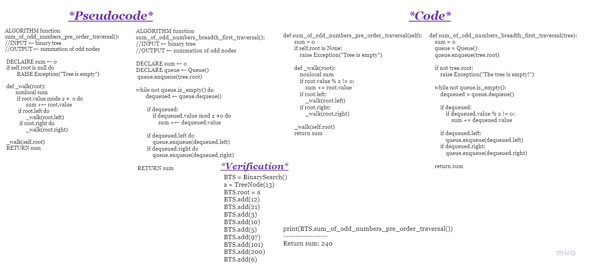

# **Challenge Summary**
You're asked to find the sum of all the odd numbers in a binary search tree, either by depth or breadth first traversal.

**Input:** a binary search tree with nodes of integers.

**Output:** the summation of only the odd nodes,

 

## **Whiteboard Process**

 

## **Approach & Efficiency**

The approach was using both the depth and breadth first traversal.

- The depth first traversal(pre order ) is of Big O:
    - Time Complexity: O(n)
    - Space Complexity: O(Log n)

- The breadth first traversal(in order) is of Big O:
    - Time Complexity: O(n)
    - Space Complexity: O(Log n)

 

## **Solution**

The solution is in the file: `sum_odd_binary.py`

The tests for the solution are in the file: `test_sum_odd_binary.py`

