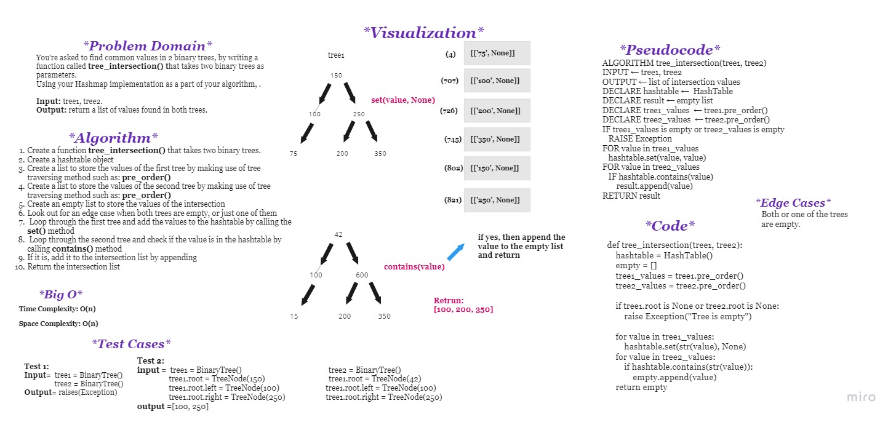

# **Challenge Summary**

You're asked to find common values in 2 binary trees, by writing a function called ```tree_intersection()``` that takes two binary trees as parameters.

Using your Hashmap implementation as a part of your algorithm, return a list of values found in both trees.

<br>

## **Whiteboard Process**



<br>

## **Approach & Efficiency**

### **Approach:**

The approach focuses on using the tree traversal and not creating extra hashtables that will use extra space. I'll be just using a singular hashtable to store the keys(value) of the first tree into and then check if the keys(values) of the second tree are in the hashtable or not. If yes append it into the intersection list. And return the list.
### **Efficiency:**

    - Time Complexity: O(n)
    - Space Complexity: O(n)


<br>

## **Solution**

Solution: [tree_intersection.py](tree_intersection/tree_intersection.py)

Tests: [test_tree_intersection.py](tests/test_tree_intersection.py)