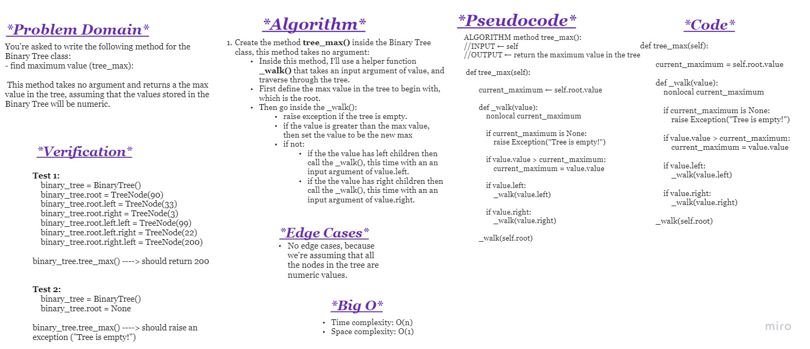
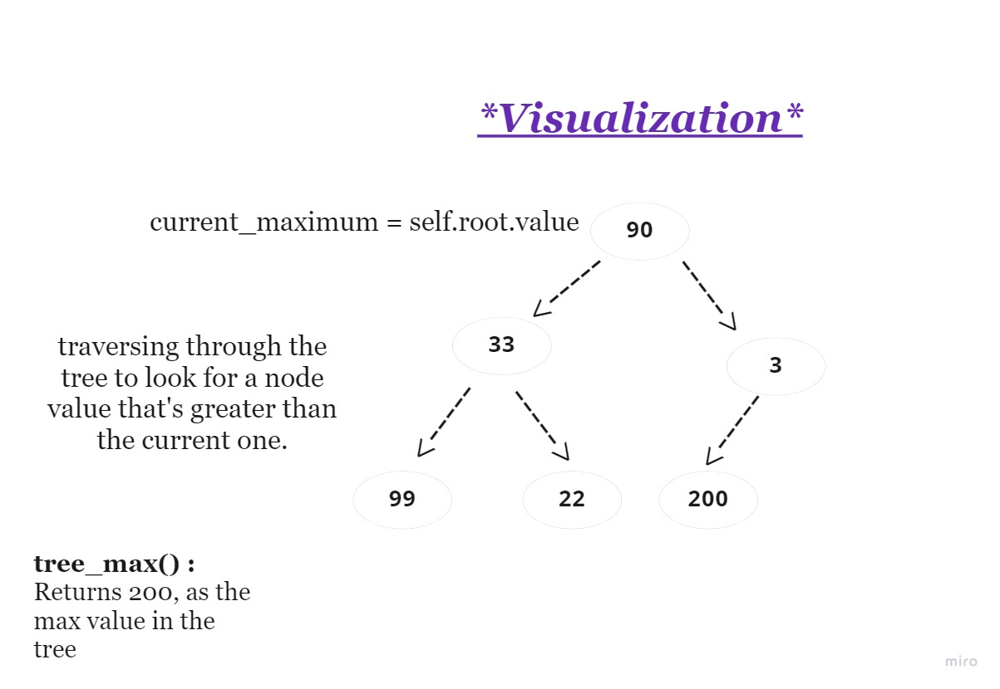

# **Challenge Summary**

~ Extending an Implementation ~

You're asked to write the following method for the Binary Tree class: 

- find maximum value (tree_max):
    
    This method takes no argument and returns a the max value in the tree, assuming that the values stored in the Binary Tree will be numeric.

 

## **Whiteboard Process**

 

## **Approach & Efficiency**

**Approach**:

using the help method of _walk(), aka recusrion to traverse through the tree and compare each node with a pre-defined maximum value each step of the way.

 

**Big O:**

- Time complexity: O(n) because I'm traversing through every node in the binary tree.

- Space complexity: O(1) because no additional space is required

 

 

## **Solution**

The solution exists in ***tree_max.py*** file, in the method ***tree_max***.

And test examples for this method, are in ***test_tree_max.py*** file.